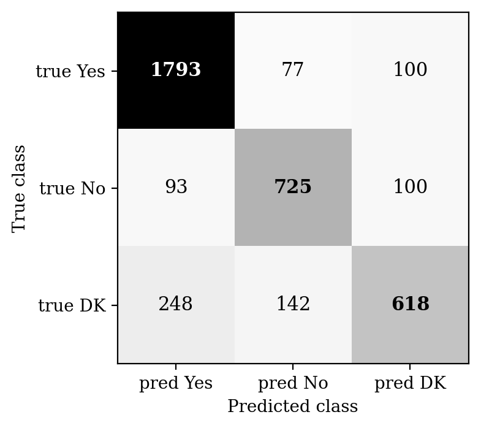
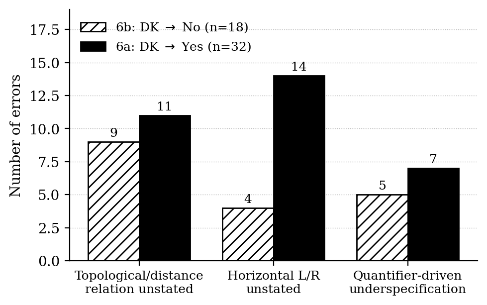

# Closed-World Defaulting in Fine-Tuned Transformer Models on SpartQA-YN

Code and annotations for an error analysis of RoBERTa-base fine-tuned on the yes/no split of [SpartQA](https://aclanthology.org/2021.naacl-main.364/). Final project for COSI 115b (NLP II) at Brandeis, May 2026.

## Summary

Fine-tuned RoBERTa-base reaches 80.49% test accuracy on SpartQA-YN but trails Yes and No recall by 17 points on the "Don't Know" (DK) class (0.61 vs. 0.79–0.91). DK-related errors account for 77.6% of all test errors. A close reading of 50 errors stratified within the dominant DK-error categories shows that conventional spatial-reasoning failures (axis confusion, polarity, distractors) are absent from the sample; the errors are uniformly cases of *closed-world defaulting* — the model commits to a truth value when the queried relation is not in the asserted set. The aggregate evidence is most cleanly read as a calibration problem rather than a knowledge problem.

## Results at a glance

### Confusion matrix on the test set



Of 760 total errors, 590 (77.6%) involve DK on the gold or predicted side. The largest single error type is DK predicted as Yes (n=248, 32.6% of all errors), more than double the rate of conventional Yes/No polarity confusions combined.

### Per-class metrics

| Class | Precision | Recall | F1    | Support |
|-------|-----------|--------|-------|---------|
| Yes   | 0.840     | 0.910  | 0.874 | 1970    |
| No    | 0.768     | 0.790  | 0.779 | 918     |
| DK    | 0.756     | 0.613  | 0.677 | 1008    |
| Macro | 0.788     | 0.771  | 0.777 | 3896    |

### Subpattern distribution in the 50 hand-labeled DK errors



Topological relations dominate the DK→No errors; horizontal underspecification dominates the DK→Yes errors. Per-cell counts are small (4–14), so the directional pattern is reported as a hypothesis rather than a confirmed finding.

## Repository contents

```
src/                              fine-tuning and evaluation scripts
figures/                          confusion_matrix.png, subpatterns.png
taxonomy.md                       the seven-category error taxonomy used for labeling
test_errors_sample50_final.csv    50 hand-labeled test errors (the analysis sample)
test_errors_sample50_final.xlsx   same data, Excel format for viewing
requirements.txt
LICENSE
.gitignore
```

## Reproducing the model

Requirements: Python 3.10+, PyTorch, HuggingFace `transformers` and `datasets`. A single GPU with 16GB+ VRAM is sufficient.

```bash
pip install -r requirements.txt
python src/train.py        # fine-tune roberta-base on metaeval/spartqa-yn
python src/evaluate.py     # produces per-class metrics and confusion matrix
```

Hyperparameters: 3 epochs, learning rate 2e-5, batch size 16, AdamW with weight decay 0.01, 500 warmup steps, FP16, max sequence length 256. Best checkpoint selected by validation macro-F1.

## The annotated sample

`test_errors_sample50_final.csv` contains the 50 errors used for the close reading: 18 from `DK_predicted_as_No` (6b) and 32 from `DK_predicted_as_Yes` (6a), sampled with seed 42 and stratified by error type.

Columns:

| Column              | Description                                                                |
|---------------------|----------------------------------------------------------------------------|
| `story`             | The multi-sentence spatial scene description.                              |
| `question`          | The yes/no question asked of the model.                                    |
| `gold`              | Gold label (always `DK` in this sample).                                   |
| `pred`              | Model prediction (`Yes` or `No`).                                          |
| `correct`           | Always `FALSE` since this file contains errors only.                       |
| `error_type`        | `DK_predicted_as_No` or `DK_predicted_as_Yes`.                             |
| `story_length`      | Story length in characters, used for sampling order within each stratum.   |
| `taxonomy_category` | Assigned category from `taxonomy.md` (here, all are `6a` or `6b`).         |
| `notes`             | Free-text annotation describing which spatial relation or quantifier was implicated. |

Single annotator. No inter-annotator reliability check. Per-cell counts in the directional analysis are small (4–14). These limits constrain how strongly any of the directional findings can be claimed.

## Data

SpartQA-Auto YN split, accessed via the HuggingFace dataset `metaeval/spartqa-yn`. 23,968 training, 3,860 validation, 3,896 test examples. Training distribution: 53.3% Yes, 18.8% No, 27.9% DK. Majority-class baseline: 50.6%.

## License

MIT — see `LICENSE`.

## Citation

```
Kim, D. (2026). Closed-World Defaulting in Fine-Tuned Transformer Models on
SpartQA-YN. COSI 115b final project, Brandeis University.
```

Built on SpartQA: Mirzaee et al. (2021), *SPARTQA: A Textual Question Answering Benchmark for Spatial Reasoning*, NAACL.
